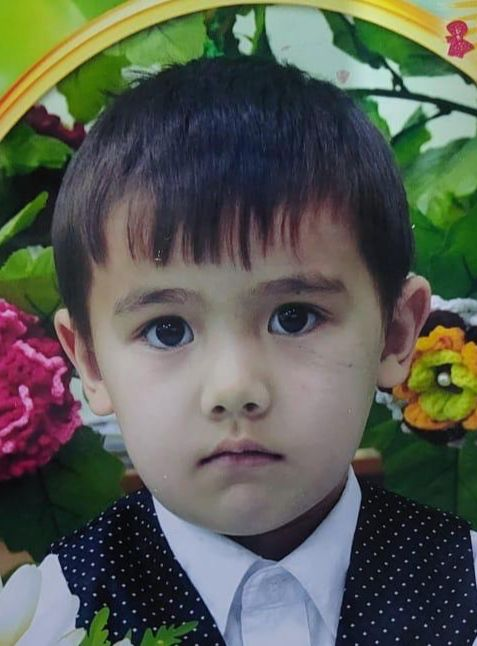

<html>
<head>
    <title>Жеке Портфолио</title>
    
</head>
<body>
    <h1>Менің Автобиографиям</h1>
    
Мен 10 - шы сыныпта оқимын. Атым Аманбек Нұрислам.

    
    
    <h2>Менің Отбасым</h2>
    <h3>Әжем-Гүлсара</h3>
    <h3>Әкем-Тұрсын</h3>
    <h3>Анам-Әсель</h3>
    <h3>Қарындасым-Ажар</h3>
    <h3>Інім№1-Дегдар</h3>
    <h3>Інім№2-Әлияр</h3>
    
    <h2>Менің Жетістіктерім</h2>
    <ul>
        <li>РФММ,Haileybury,BIL,NIS,Daryn,NURORDA мектептерінің оқуына грант иегерімін<</li>
        <li>Математика пәнінен облыстық олимпиададан 3 орын иегерімін</li>
        <li>Change the World Model UN бүкіл әлім лидерлер арасындағы программаға грант иегерімін</li>
    </ul>
    
    <h2>Менің Мамандығым</h2>
    
Мен болашақта Computer Science сферасынан Software Engineer мамандығын таңдаймын.

    
    

        <h2>Менің Тарихта қалдырар Ізім</h2>
        
Менің жобаларым мен жетістіктерім келешекке үлес қосамын

        
Ғылым мен технологияда мүгедектерге көмектесетін бағдарламалар арқылы өз ізімді қалдырамын

    

    
    <h2>Контакт Ақпарат</h2>
    <table border="1" width="100%" bgcolor="99CCCC">
        <tr bgcolor="CCCCFF" align="center">
            <td>Пән</td>
            <td>Байланыс</td>
        </tr>
        <tr>
            <td>Email</td>
            <td>nurislam100521@email.com</td>
        </tr>
        <tr>
            <td>Телефон</td>
            <td>+7 700 431 2008</td>
        </tr>
    </table>
</body>
</html>
